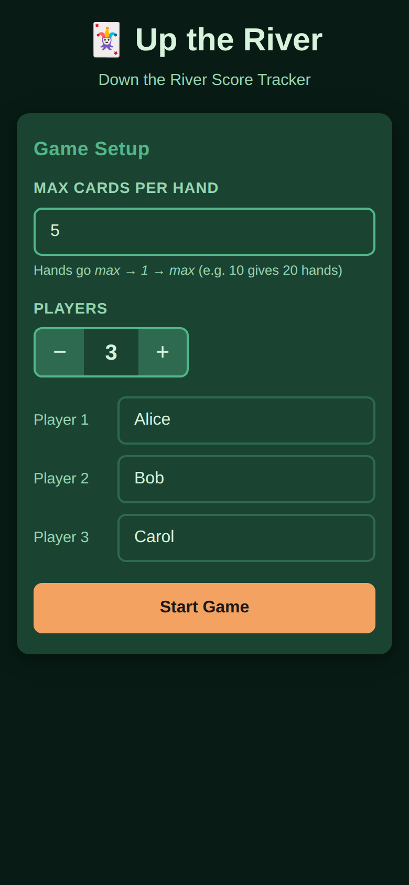
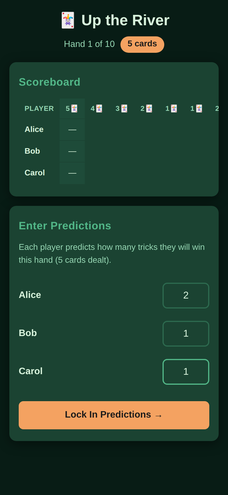
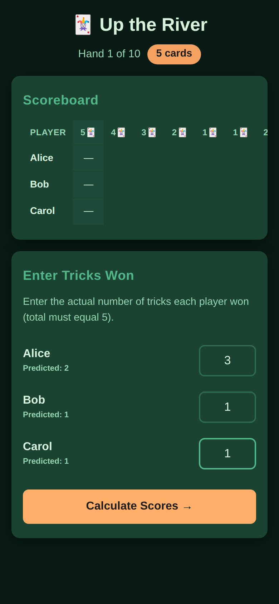
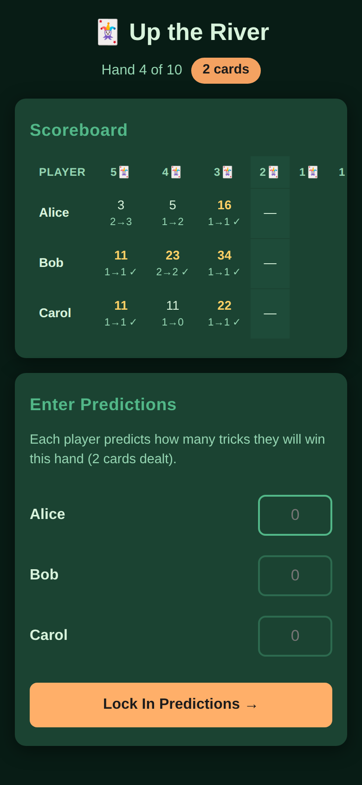

# Up the River – Score Tracker

A mobile-friendly, single-page web app for scoring games of **Up the River, Down the River** (also known as "Oh Hell").

## Features

- Add 2–10 players with custom names
- Configurable max cards per hand (default 10 → gives 20 hands: 10→1, then 1→10)
- Per-player trick predictions at the start of each hand
- Automatic scoring: **tricks won + 10 bonus** if prediction is exact
- Running scoreboard updated after every hand
- Final results screen with ranking
- Works on desktop and mobile

## Scoring rules

| Result | Points |
|---|---|
| Prediction correct | tricks won + 10 |
| Prediction wrong | tricks won |

## Deployment to GitHub Pages

### First-time setup

1. Go to **Settings → Pages** in this repository.
2. Under **Source**, select **GitHub Actions**.
3. Push to (or merge a PR into) the `main` branch — the **Deploy to GitHub Pages** workflow will run automatically and publish the site.

### Manual deployment

You can also trigger the workflow manually from **Actions → Deploy to GitHub Pages → Run workflow**.

### Live URL

After the first successful deployment the site will be available at:

```
https://<your-github-username>.github.io/uptheriver/
```

## Screenshots

### Setup screen – configure players and max cards


### Predict phase – enter trick predictions for hand 1


### Tricks phase – enter actual tricks won


### Mid-game scoreboard – populated after several hands


### Results screen – final rankings

